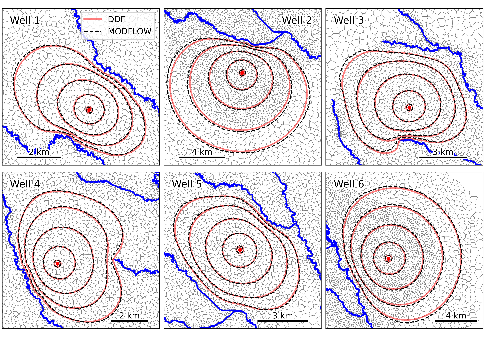
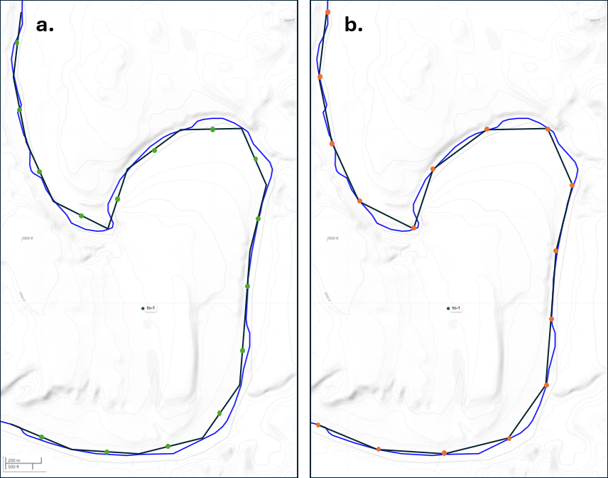
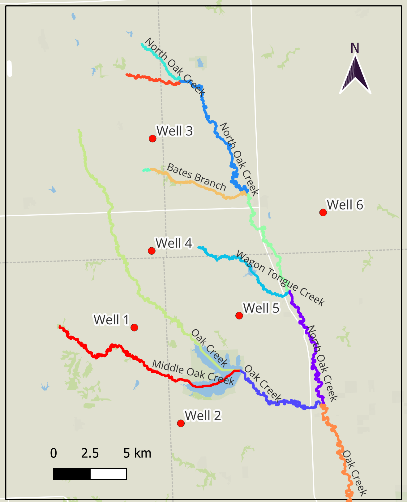

<p align="center">
  
</p>


# DDF — Distributed Drawdown Function for Estimating Pumping Effects on Complex Stream Networks

DDF is a Fortran-based toolkit for analyzing **stream depletion** and **drawdown** caused by groundwater pumping using a superposition approach.
The project is organized as a small scientific codebase you can build locally and integrate into hydrogeologic workflows.

> Repository: `sspa-inc/ddf` (Fortran)
> Directories: `src/` (sources), `bin/` (build/run helpers), `examples/` (build/run helpers)
> Status: early-stage research code

<p align="center">
  
</p>
---

## Why DDF?

Groundwater pumping near hydraulically connected streams may induce **streamflow depletion**. Most analytical models require simplified representations of streams and stream-aquifer-well hydraulics, and numerical models require considerably more data and intensive computation to improve upon analytical estimates. DDF is an analytical tool designed to efficienty estimate groundwater drawdown and stream depletion caused by pumping near complex, meandering stream networks. Further details on the method are available in Ou et al, 2026.

DDF aims to provide a lightweight, transparent implementation that can be:
- **Auditable**: minimal dependencies, readable Fortran.
- **Reproducible**: deterministic numerics.
- **Composable**: callable from other tools or batch pipelines.
- **Efficient**: extremely fast compared with building and running a numerical model.

> If you use this code in a publication or report, please cite the relevant source (see “Citing” below). DDF was developed by S.S. Papadopulos & Associates, Inc with funding contributions from the New Mexico Office of the State Engineer and the Bureau of Reclamation WaterSMART Applied Science Grant Program.

> DISCLAIMER: This program is provided FREE of charge. The authors request only that application of the software and production of results using the code is accompanied by a suitable acknowledgment. The software is provided “AS IS”, without warranty of any kind, including without limitation the warranties of merchantability, fitness for a particular purpose and non-infringement. The entire risk and responsibility as to the quality and performance of the Software is borne by the user. The author(s) disclaim all other warranties.


<p align="center">
  
</p>

---

## Build

You can build with a modern Fortran compiler (e.g., `gfortran >= 10`, `ifx/ifort`, or `nvfortran`). The project is small enough to compile directly without a build system, but you may optionally add CMake or Makefiles.

Executables for Windows 64, Mac, and Linux have been pre-compiled for convenience in `bin\all_executables`. The project was developed in Windows, so the default executable in the `bin` directory is the Windows 64 executable. Batch scripts and other features for running the example may also be tailored to Windows users. The Mac and Linux executables have been provided, but have not yet been rigorously tested. To use one of these alternate executables, copy it from `bin\all_executables` into the main `bin` directory. 

### Quick build (gfortran)

```bash
# from the repo root
cd src
gfortran -O2 -Wall -fbacktrace \
  sgesv.f \
  spatial.f90 \
  grid.f90 \
  time.f90 \
  riv.f90 \
  well.f90 \
  io.f90 \
  writejson.f90 \
  conrec.f \
  ddf.f90 \
  -o ..\bin\ddf
```

## Run

DDF is designed as a command-line tool. A typical pattern is:

```bash
./ddf path/to/case.in [1]
```
where `path/to/case.in` is the DDF config file. If the second argument is present and is `1`, DDF will calculate the drawdown using the closest stream segment to the pumping well with the traditional Theis image well method.

## Input

DDF requires the following input files:

Config File: a text file describing grid, and specifying the locations of input files containing details on the pumping well, stream nodes, observation locations, and output times.

Well file: a text file including the well location, aquifer parameters (T,S) pumping rate, and pumping schedule.

Observation file: a text file including locations of specified observation locations. If this option is specified, DDF will output a time series of drawdown at these locations.

Stream file: a text file including the end coordinates defining each stream reach.

Time file: a text file including times for which output is written.

### DDF Config File Format

#### Line 1

```lfac, ddriv_min [dptor] [radius] [nodefac]```

 - `lfac`: numeric (integer or real). This is the unit conversion factor from the coordinate system to the model and also controls how the next line is interpreted: \\
If lfac < 0 → Line 2 must be an observation file name (see Branch A).                   \\
If lfac > 0 → Line 2 must be two numbers: cellsize1, cellmutl (see Branch B).

 - `ddriv_min`: real. A small positive threshold used in stream processing (e.g., a cutoff/tolerance), in units of [L]. For each time step, the radial drawdown from pumping in absence of any boundary conditions is calculated. Stream nodes having drawdowns smaller than this threshold are excluded from pumping impact calculation. A recommended starting value is 0.001, but this threshold could be increased to speed up DDF run times.

 - `dptor`: real. A small positive threshold used in stream processing (e.g., a cutoff/tolerance), unitless. For each time step, stream nodes with leakage weights less than this factor are removed and weights are recalculated. Conceptually, this filters out nodes which are "screened", or out of sight of the pumping well. A recommended starting value is 1e-4. Values which are too high may lead to insufficient number of nodes. If not entered, a default value of 1e-10 is used.

 - `radius`: real. The well radius used in drawdown calculation, in units of [L]. When the distance is smaller than this radius, this radius is used for the distance. If not entered, a default value of 0.5 [L] is used.

 - `nodefac`: real. A value between 0 and 1 is used to denote where the stream node should be placed along each stream reach. A value of 0 places it at the first endpoint, and a value of 1 places it at the second endpoint. If not entered, a default value of 0.5 (midpoint) is used.

<p align="center">
  
</p>

*Panel A shows a nodefac value of 0.5 (midpoint), while panel B shows a nodefac of 1 (endpoint). This example river is coarsely discretized to better show the difference between nodefac values.*

#### Line 2

##### Case A: `lfac < 0`:

The observation coordinates (where drawdown time series are estimated) are read from an observation file.

```observationfile```

 - `observationfile`: path to an observation file the code expects. Use a path without spaces or put it in quotes.

##### Case B: `lfac > 0`:

DDF generates a structured grid centered on the pumping wells. The grid cell size is controlled by the specified minimum cell size and a geometric growth ratio, ensuring finer resolution near the pumping wells and coarser resolution farther away.

`cellsize1, cellmutl, gridrmax`

 - `cellsize1`: real. Base cell size, in units of [L]. This is the cell size used at the well locations.

 - `cellmutl`: real. Cell size multiplier (e.g., >1 for geometric growth, =1 for uniform).

 - `gridrmax`: real. Maximum grid extent as the distance from the well center. If `gridrmax <= 0`, the grid extent will be calculated using the well function at the distance with a drawdown equal to `ddriv_min`.

#### Line 3

The gridded drawdown results (Case B) are interpolated into contours, which are written by the program in geoJSON format.

```contourlevel```

 - `contourlevel`: real. A contour/drawdown level used by the program for the geoJSON output, in units of [L]. if `contourlevel <= 0`, geoJSON output will **not** be created.

#### Line 4

```wellfile```

 - `wellfile`: path to a well definition file.

#### Line 5

```streamfile```

 - `streamfile`: path to the stream definition file.

#### Line 6

```timefile```

 - `timefile`: path to a output time file.

#### Line 7

```prefix```

 - `prefix`: prefix used for output file names.

#### Example config file
This example assumes Case B. Note ```lfac=3.2809``` which is a conversion from coordinates provided in UTM NAD 83 (meters) to DDF calculations computed with model length unit of feet.

```
3.2809 1e-3      # lfac, ddriv_min
50 1.1 0         # cellsize1, cellmutl, gridrmax
1                # contourlevel
well1.csv        # wellfile
riv.csv          # streamfile
times.csv        # timefile
project1         # prefix
```

### Observation File Format

The observation file includes the locations at which drawdown time series will be written. Below is an example:

```csv
x,y,name
580603.7,3561767.74,obs-1
578286.96,3560010.11,obs-2
```
 - `x,y` (real) is the coordinates of the observation location. Units must either correspond to model or have appropriate ```lfac``` specified.
 - `name` (text) is the name of the location.

### Well File Format

The well file includes the pumping well location, pumping rate, and pumping schedule. DDF can simulate multiple pumping wells. Below is an example:

```csv
x,y,transmissivity,storage,rate,timeOff
580745.46,3560222.67,500,0.05,35778.23409,999999
574669.73,3558887.47,500,0.05,-35778.23409,999999
```
 - `x,y` (real) is the coordinates of the well. Units must either correspond to model or have appropriate ```lfac``` specified.
 - `transmissivity` (real) is the transmissivity of the aquifer in units of [L2/t].
 - `storage` (real) is the storage coefficient of the aquifer, unitless.
 - `rate` (real) is the pumping rate in units of [L3/t]. Positive rate reflects pumping and negative rate reflects injection.
 - `timeOff` (real) is the time when the pumping is shut off in units of [t].

For each specified pumping well, pumping is simulated starting from time 0. A pumping end time may be specified, but a variable pumping rate may not be defined using a single well.

### Stream File Format

The stream file includes the coordinates of the stream reaches, which are formed by two vertices for each reach. The user must prepare this file using a uniform stream discretization appropriate for the application.

```
x1,y1,x2,y2,seg
521678.6867,3548145.422,522026.5997,3548294.477,1
522026.5997,3548294.477,522332.7718,3548200.005,1
522332.7718,3548200.005,522513.5645,3548063.242,1
522513.5645,3548063.242,522745.9268,3547812.08,1
```
 - `x1,y1,x2,y2` (real) are the coordinates of the stream vertices. Units must either correspond to model or have appropriate ```lfac``` specified.
 - `seg` (integer) is the segment number. This is used to group the stream reaches when determining if a segment (i.e., a branch of the stream network) is on the opposite side of the stream network than the pumping well with respect to the streams being impacted. Stream segments which are fully on the opposite side of the interacting stream segment are excluded from the calculation.

### Output Time File Format

The output time file includes includes drawdown estimation (output) times. Depending on the value of ```lfac```, the DDF program will either write drawdown at specified point locations or generate drawdown contours at these times. Stream depletion will also be written at these times.  Example:

```
times
3652.5
7305
10957.5
14610
18262.5
21915
25567.5
29220
32872.5
36525
```
 - `times` (real) a list of output times to write drawdown, in units of [t].

## Output

The following outputs are generated:

 - `[prefix]_dd.csv` is CSV or TSV is computed drawdown [L] at specified observation locations, at specified output times.
 - `[prefix]_dl.csv` is CSV or TSV is computed cumulative stream depletion rate [L3/t] at all stream reaches, at specified output times.
 - `[prefix]_cc_[time].geojson` is a geoJSON file of drawdown contours [L], at specified output times. One file is written per specified output time. This file is only generated when `lfac>0`.

 Note on depletion output: The DDF program writes depletion as a rate [cumulative depletion volume]/[cumulative elapsed time]. This may be converted as needed by the user to a Stream Depletion Factor (SDF) consistent with Jenkins (1968) by computing the cumulative volume and normalizing to the cumulative pumping at a given time.


## Example Illustration

The hypothetical site study compares drawdown and stream depletion estimated by DDF to those simulated by a single-layer MODFLOW 6 (Langevin et al, 2017) groundwater model for a complex stream network in the Oak Creek watershed in eastern Nebraska. A constant pumping rate of 574 m3/day (equivalent to approximately 170 af/yr) is simulated at each of six wells located throughout the network for a simulation period of 50 years. The wells are positioned such that they are varied in their proximity to the stream network and the complexity of the closest portion of the network (i.e., meanders versus relatively linear or multiple nearby tributaries).

The numerical model is constructed to be consistent with the Theis equation assumptions inherent to the DDF method and is not intended to represent heterogeneity or historical conditions at the case study site: The aquifer has a homogeneous hydraulic conductivity of 3 m/day, a thickness of 30.5 m, and a storativity of 0.1. The MODFLOW model is constructed using a Voronoi grid with local refinement near streams and pumping wells, implemented using FloPy (Hughes et al., 2024). Cell areas range from approximately 0.01 km2 along the stream channel up to 270 km2 far from the streams. An initial head of 0 m was specified, such that the initial head coincides with the model top elevation. The MODFLOW model applies a constant head boundary condition of 0 m to represent the stream network so that the stream is always connected to the aquifer and provides a constant source of water. No other model stresses are applied. Identical aquifer properties were applied to the DDF calculation. For the DDF inputs, the stream network was discretized into 100-m uniform reaches. Notably, DDF achieves results in seconds, whereas the MODFLOW simulation requires significantly longer run times.

This script has several associated dependencies, so for convenience, a virtual environment setup is included. 
- To build the environment with conda, run `conda env create -f ddf_environ.yml` in the command line from the `Example` directory
- Activate the environment by running `conda activate ddf_environ` before running the python scripts.

To create the DDF input files, run the Python script `_create_ddf.py`. 
To run the example, call the batch scripts `01_run_each_well.bat` to run DDF and `02_run_mf.bat` to run MODFLOW. 
To generate plots of the results, run the Python script `_plot_results.py`


<p align="center">
  
</p>

## Citing

*Ou, G., Rogers, J.D., Sandoe, L., Barth, G., 2026. A Rapid Analytical Tool for Estimating Pumping Effects on Complex Stream Networks. (under review)*
